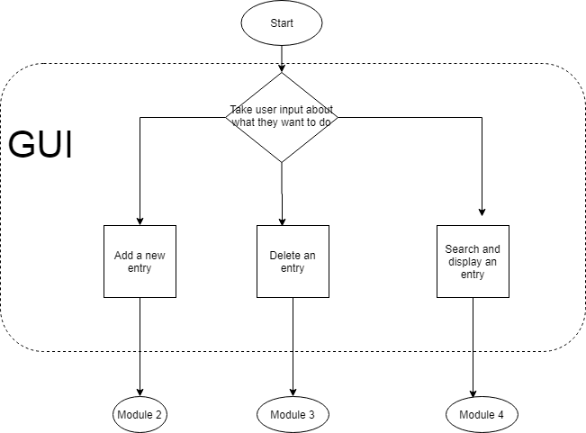
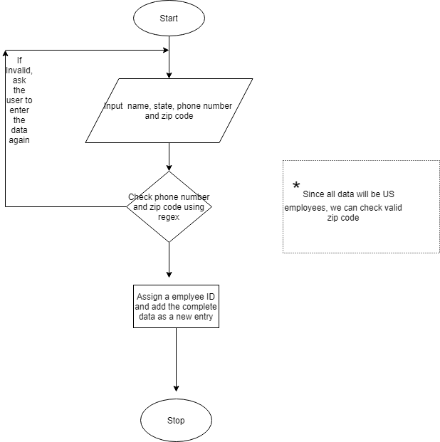
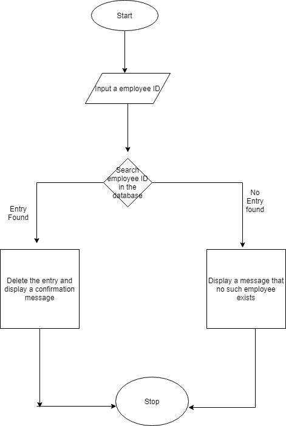
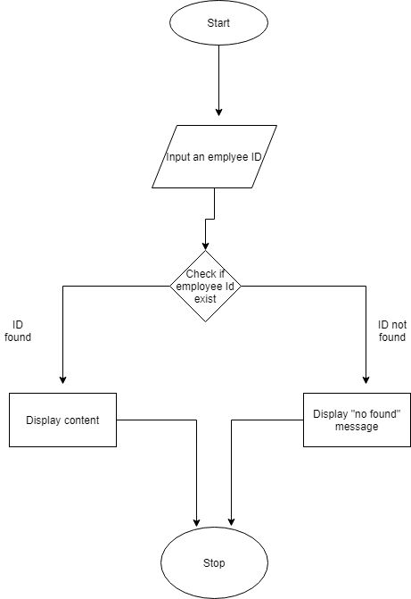

# **Employee Database**

### **This program allows you to manage an Employee Database. Users will interact with a GUI application which allows the addition of a new employee, the deletion of an existing employee or the ability to search for any existing employees.**

## ***Code description***

***ClassEmployee:*** 

### Variables-
   
      • Employee ID (Primary Key- Will be auto generated) 

      • First Name 

      • Last Name 

      • State

      • Zip code

      • Phone number 
      
### ***inputData():*** 

This function will input first name, last name, state, zip and phone number and will call validateZipPhone() function to verify if the zip code and phone number entered are of US standards. If they are valid, it will call addData(). 
 
### ***validateZipPhone():***

This function will use regex to verify if zip and phone number entered are of US standards. 
 
### ***addData():***

This will generate a new employee id and add the data in the database. 
 
### ***searchData():*** 

This function will input an employee id and will search the database for it. 
 
### ***deleteData():***

This will take an employee id and will delete the employee entry if present.  
 
 
 
## ***Modules***

      -Tkinter (GUI) 

      -Openpyxl (to store and retrieve data into an excel file)

